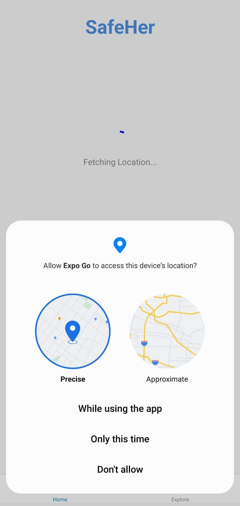
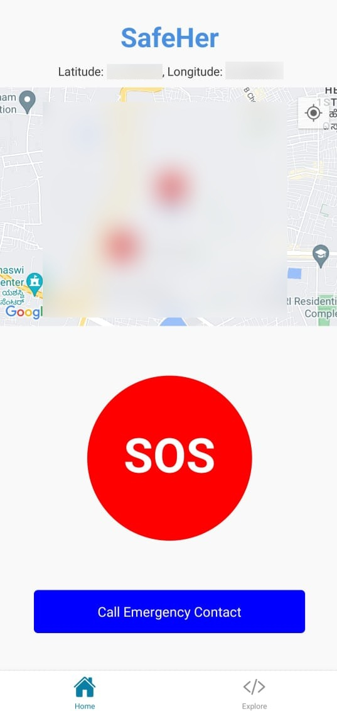
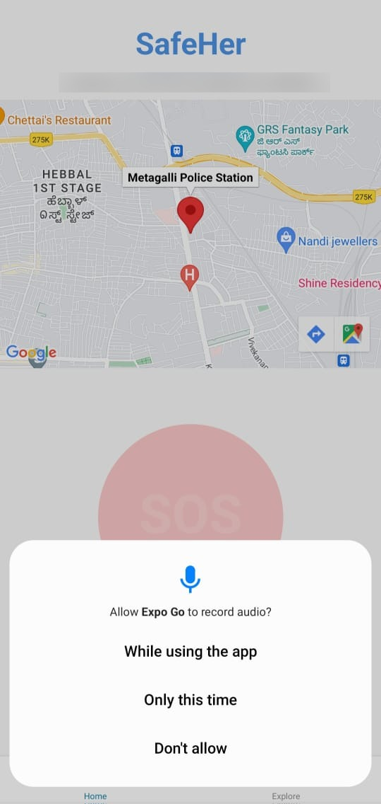
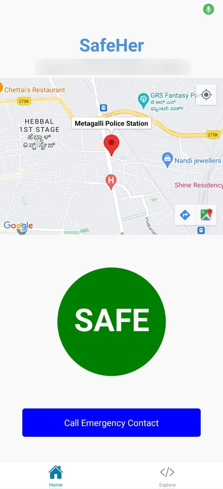
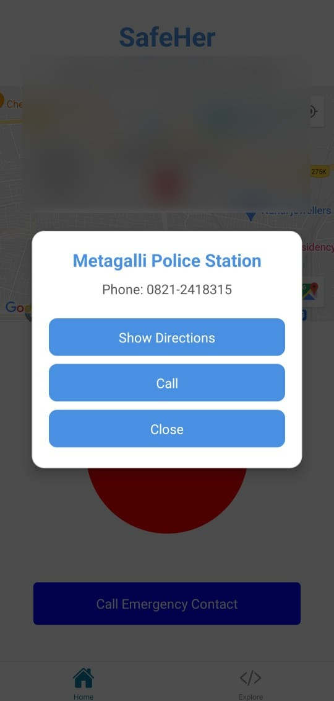
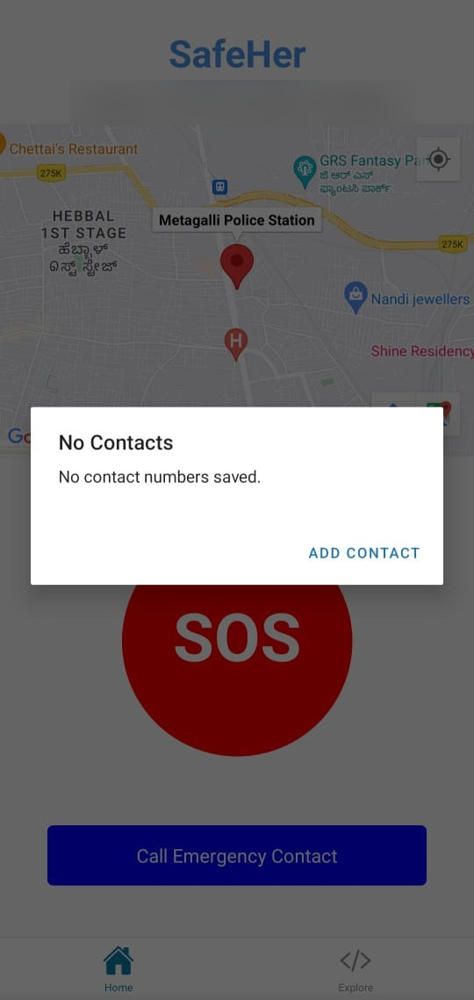
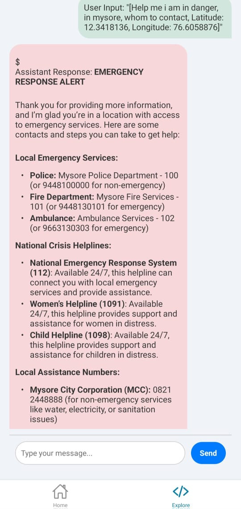

# Women Safety App
### A React Native application designed to enhance personal safety for women through innovative features such as location tracking, audio recording, and emergency services integration.

## Table of Contents
- [Introduction](#introduction)
- [Prerequisites](#prerequisites)
- [Installation](#installation)
- [Project Setup](#project-setup)
- [Configure API Keys](#configure-api-keys)
- [Run the App](#run-the-app)
- [Configure Firebase Storage Rules](#configure-firebase-storage-rules)
- [Preview](#preview)
- [Notes](#notes)
- [About the Team](#about-the-team)
- [License](#license)
- [Contribution Guidelines](#contribution-guidelines)
- [Contact](#contact)


## Prerequisites

Make sure you have the following installed on your system:
- [Node.js](https://nodejs.org/) (version v20.18.0 recommended)
- Make sure it is installed by using following commands
  
  ```bash
  node -v
  npm -v
  ```

## Installation

1. **Create React App**

   ```bash
   npx create-expo-app@latest
   cd Women-Safety-App-Name
   ```
   
2. **Install Required Packages**

   Run the following commands to install the necessary libraries for the project. Make sure to install these one by one or use `yarn` to install them together if using Yarn:

   ```bash
   npm install react@17.0.2 react-native@0.64.2 react-native-markdown-display@6.1.1 groq-sdk@0.1.1 expo-location@13.1.0 expo-av@10.2.0 axios@0.24.0 firebase@9.1.3 react-native-maps@1.14.0 react-native-webview@13.8.6 react-native-modal@13.0.0
   ```

## Project Setup

   Replace the `index.tsx` and `explore.tsx` files located in the `app/tabs/` directory with `index.tsx` and `explore.tsx` files. Copy `firebaseConfig.ts` file into `app/tabs/`. This folder structure follows the Expo Router approach for navigation.

   - Copy `index.tsx` file into `app/tabs/`
   - Copy `explore.tsx` file into `app/tabs/`
   - Copy `firebaseConfig.ts` file into `app/tabs/`

### Configure API Keys

1. **Groq API Key**:
   - Obtain your Groq API key by signing up and creating an account on [Groq's official website](https://console.groq.com/playground).
   - Once you have the API key, open your `explore.tsx` code and locate any instances of `YOUR_GROQ_API_KEY`.
   - Replace `YOUR_GROQ_API_KEY` with your actual key in the code as follows:

     ```javascript
     const GROQ_API_KEY = 'YOUR_GROQ_API_KEY';
     ```

     For more detailed steps, refer to Groq's documentation on API key management [here](https://groq.dev/docs/getting-started#api-keys).

2. **Firebase Configuration**:
   - If you haven't already, go to the [Firebase Console](https://console.firebase.google.com/), create a new project, and set up Firebase Storage.
   - After setting up, obtain your Firebase configuration details by navigating to **Project Settings > General** and scrolling to **Your apps**. Click on the **Web** icon to register a new app and get your configuration.
   - In your `firebaseConfig.ts` file, replace placeholders with your Firebase config values:

     ```javascript
        import firebase from 'firebase/app';
        import 'firebase/storage';
        
        const firebaseConfig = {
          apiKey: "YOUR_API_KEY",
          authDomain: "YOUR_PROJECT_ID.firebaseapp.com",
          projectId: "YOUR_PROJECT_ID",
          storageBucket: "YOUR_PROJECT_ID.appspot.com",
          messagingSenderId: "YOUR_MESSAGING_SENDER_ID",
          appId: "YOUR_APP_ID"
        };
        
        // Initialize Firebase
        const app = initializeApp(firebaseConfig);
        const storage = getStorage(app);
        
        export { storage };
     ```

   For more details, refer to Firebase's [setup documentation](https://firebase.google.com/docs/web/setup).

---
  

2. **Run the App**

   Start the app using Expo:

   ```bash
   npm start
   ```

   This command will open the Expo Developer Tools in your browser. You can then choose to run the app on an Android or iOS simulator, or on your physical device via the Expo Go app. 
   ***Curently the App is working properly in Expo Go***

### Configure Firebase Storage Rules

To allow your app to read and write files to Firebase Storage, you may need to modify the default security rules. By default, Firebase restricts access to ensure data security. For development purposes, you can update the rules to make it easier to test, but **make sure to revert to more restrictive rules before going to production**.

Update your Firebase Storage rules to the following to allow unrestricted read and write access: 

```plaintext
   rules_version = '2';
   service firebase.storage {
     match /b/{bucket}/o {
       match /{allPaths=**} {
         allow read, write: if true; // Grants unrestricted read and write access or `allow read, write;` if this doesn't work
       }
     }
   }
  ```

   This will allow any user to read and write data in your Firebase Storage, which is suitable only for development.

 **Important**: For production, secure your data by adding appropriate authentication rules. You can learn more about Firebase Storage security rules [here](https://firebase.google.com/docs/rules).


---

## Preview

Below are some screenshots of the Women Safety App. You can scroll through them to get a better view of the app's features.


<div style="display: flex; overflow-x: auto; white-space: nowrap; padding: 10px;">
  
  
  
  
  
  
  
</div>

---

### Notes

- ***Recorded audio is saved in Firebase Storage, allowing for secure access and further analysis.***
- Ensure your Expo CLI and dependencies stay updated to maintain compatibility.
- Connect the external device with Expo App to the same network as your system.
- You may adjust any configurations in `app.json` or `tsconfig.json` as per your requirements.

Enjoy developing with Women Safety App! If you encounter any issues, feel free to check the [Expo documentation](https://docs.expo.dev/) or reach out for support.

## About the Team

This project was developed by our dedicated team. We are proud of our collective efforts and the innovative solutions we've created!

| Team Member         | GitHub Profile                                           | Email                        |
|---------------------|----------------------------------------------------------|------------------------------|
| **Priyanka M K**    | [Priyaaaa2](https://github.com/Priyaaaa2)                | priyankamk2903@gmail.com     |
| **Sumukh C**        | [Sumu004](https://github.com/Sumu004)                    | sumukhchaluvaraj@gmail.com   |

We appreciate the hard work and collaboration that made this project possible!
